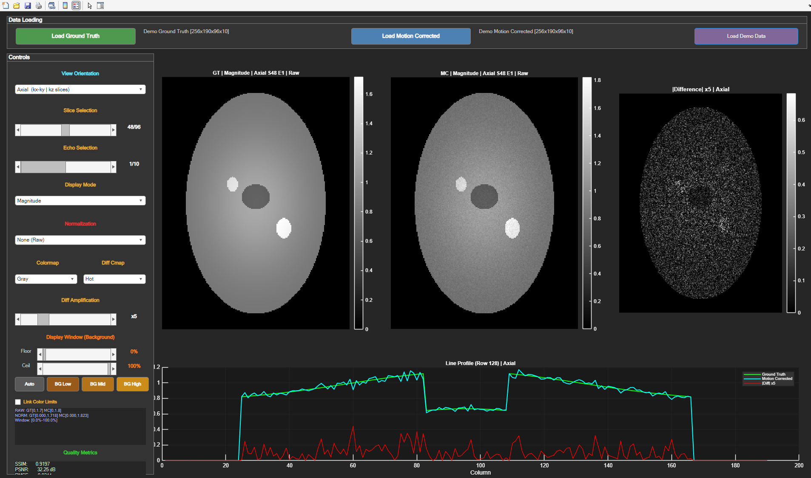

# MRI Comparison Tool

A MATLAB GUI for side-by-side visual comparison and quality assessment of **ground truth** and **motion-corrected** multi-echo MRI datasets.



---

## Overview

This tool provides an interactive MATLAB figure for inspecting 4-D complex MRI data `(kx, ky, kz, echoes)`. It is designed for researchers working on motion correction algorithms who need to quickly evaluate reconstruction quality across slices, echoes, and anatomical planes — without requiring any additional MATLAB toolboxes.

---

## Features

- **Three anatomical views** — Axial, Coronal, and Sagittal, switchable on the fly with automatic slice-count and slider updates
- **Four display modes** — Magnitude, Phase, Real Part, Imaginary Part
- **Difference map** — Amplified absolute difference or wrapped phase difference between GT and MC
- **Quality metrics** — SSIM, PSNR, RMSE, NRMSE, Pearson correlation, and phase RMSE computed per slice/echo
- **Display windowing** — Floor/Ceiling sliders and one-click presets (`BG Low / Mid / High`) to reveal background signal
- **Normalization modes** — None, Per-Slice, Global, and Percentile (1–99%)
- **Line profile plot** — Intensity profile along the middle row of the current slice for GT, MC, and their difference
- **ROI Analysis** — Draw a freehand ROI on any slice and compute per-echo metrics within it
- **Export** — Save the current three-panel view (GT / MC / Diff) or batch-export all echoes for a given slice
- **Keyboard navigation** — `←` / `→` to step through slices, `↑` / `↓` to step through echoes
- **Large file support** — Uses `matfile()` for partial loading of HDF5/v7.3 `.mat` files; falls back to `load()` automatically
- **No toolboxes required** — SSIM is computed with a `conv2` Gaussian kernel

---

## Requirements

- MATLAB R2019b or later (earlier versions may work)
- No additional toolboxes needed
- ROI Analysis uses `drawfreehand` (requires Image Processing Toolbox if used)

---

## Getting Started

1. Clone or download this repository
2. Open MATLAB and navigate to the project folder
3. Run the tool from the command window:

```matlab
MRI_Comparison_Tool_v4
```

4. Click **Load Demo Data** to explore the interface immediately with a synthetic 256 × 190 × 96 × 10 dataset, or load your own `.mat` files using the **Load Ground Truth** and **Load Motion Corrected** buttons.

---

## Data Format

Input `.mat` files should contain a 4-D complex array with dimensions:

```
(kx,  ky,  kz,  echoes)
 dim1 dim2 dim3 dim4
```

| View | Plane displayed | Slider iterates over |
|------|-----------------|----------------------|
| Axial | kx – ky | kz (dim 3) |
| Coronal | kx – kz | ky (dim 2) |
| Sagittal | ky – kz | kx (dim 1) |

Both real and complex arrays are accepted. If real data is loaded, Phase and Imaginary modes will display zeros.

---

## Version History

| Version | Highlights |
|---------|-----------|
| v4 | Axial / Coronal / Sagittal view selection; `extractSlice` helper; view-aware export filenames |
| v3 | Display windowing (Floor / Ceiling sliders); background preset buttons |
| v2 | `matfile()` partial loading for v7.3 files; toolbox-free SSIM; safe sliders for single-slice data |
| v1 | Initial release |

---

## License

MIT License — see [`LICENSE`](LICENSE) for details.
